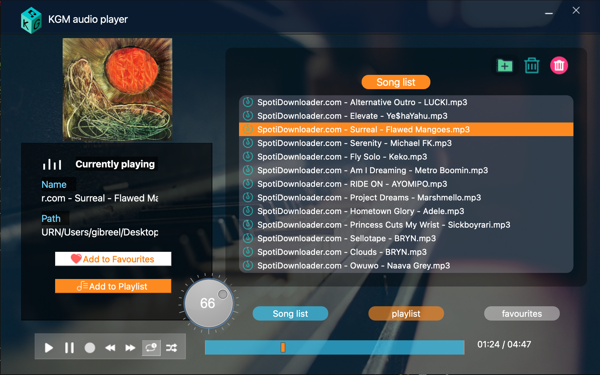

# KGM-audio-player
Free Open source audio player written in python and QT

# 🎵 KGM Music Player

KGM Music Player is a modern, minimal, and feature-rich desktop music player built using Python and PyQt5. It offers a sleek interface, powerful audio features, and a personalized user experience.

---

## ✨ Features

### 🎧 Audio Playback
- Supports `.mp3`, `.wav`, and `.ogg` file formats.
- Play, pause, stop, skip forward/backward.
- Volume control and mute toggle.

### 📁 Playlist Management *** (work in progress feature faulty)
- Add multiple songs from your library.
- Save and load custom playlists.
- Clear or reorder playlist tracks.

### ❤️ Favourites (work in progress feature faulty)
- Mark songs as favourites.
- Dedicated "Favourites" tab for quick access.
- Persistent favourites saved between sessions.

### 🖼️ Album Art & Metadata
- Displays embedded album art (if available).
- Song title, artist, and duration shown dynamically.

### 🕹️ User Interface
- Flat modern design with hover and click effects.
- Animated playback progress slider.
- Custom-styled buttons and dark/light mode compatibility.

### 🔁 Shuffle & Repeat
- Toggle between loop and shuffle modes.
- Smart queue system for uninterrupted listening.

### 💾 Persistent Storage
- Saves user preferences and favourites to disk.
- Loads saved state when the app restarts.

---

